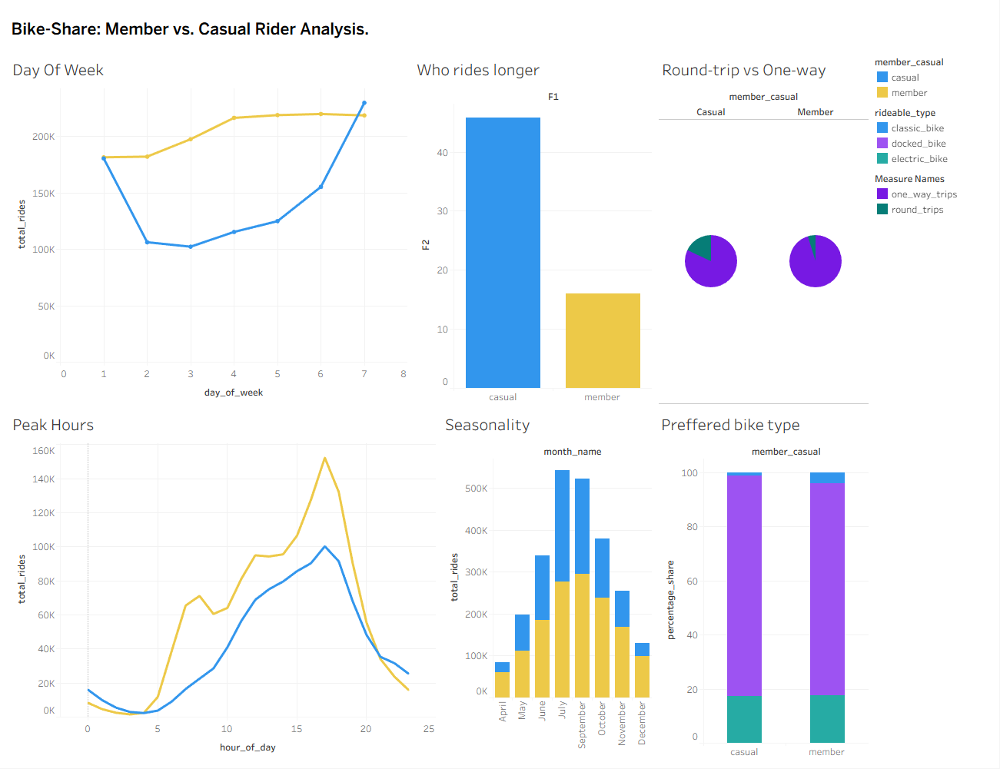

# Cyclistic-Bike-Share-Analysis
The dataset I used is public data from Divvy, the real-world bicycle-sharing system in Chicago. It is made available by Motivate International Inc. under a public license. For the purpose of this case study, the data represents a fictional company named Cyclistic.

## 1. The Business Task
Cyclistic, a bike-share company in Chicago, wants to maximize the number of annual memberships. The goal of this project is to analyze how casual riders and annual members use Cyclistic bikes differently, and to recommend marketing strategies to convert casual riders into members.

## 2. Data Preparation & Processing
I used 8 months of historical trip data provided by the company. To handle this massive dataset, I used **BigQuery (SQL)** to combine, clean, and aggregate the data. 
* *View my SQL cleaning queries in this repository.*

## 3. Data Analysis & Insights
After processing the data, I used **Tableau** to visualize the differences in rider behavior. 

**Key Findings:**
* **Casuals ride longer:** Casual riders average 45-minute trips, while members average 16 minutes.
* **Weekend peaks:** Casual usage spikes heavily on weekends and during the summer/fall months.
* **Commuter patterns:** Members use bikes consistently on weekdays at 8 AM and 5 PM.

## 4. Recommendations
Based on the data, I recommend the following three strategies to convert casual riders into annual members:
1. **Launch a "Summer Weekend" Pass:** Target the high volume of weekend leisure riders.
2. **Highlight Financial Savings:** Show casual riders how much money they can save on 45+ minute rides by upgrading to a membership.
3. **Target Tourist Stations:** Place physical ads at coastal and park stations where round-trip casual rides are most frequent.
